# LiftOff

A free, open-source, gamepad-first game and app launcher for Windows handhelds. Steam, Game Pass, GOG, Epic, Battle.net, and cloud games in one library you drive from the couch.

[](https://discord.gg/F5ncP75WtD)
[](https://buymeacoffee.com/liftoff_handheld_launcher)

<p align="center">
  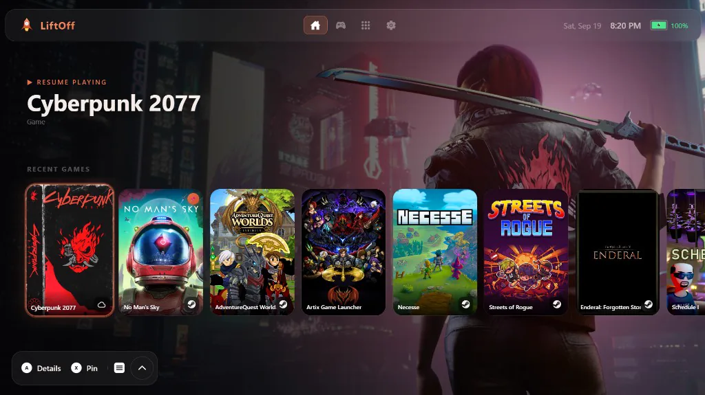
</p>

**[Download 2.0](https://github.com/PixelateWizard/LiftOff/releases/latest)** · **[liftofflauncher.app](https://liftofflauncher.app)** · **[Release notes](RELEASE-NOTES-2.0.0.md)**

---

## Screenshots

<p align="center">
  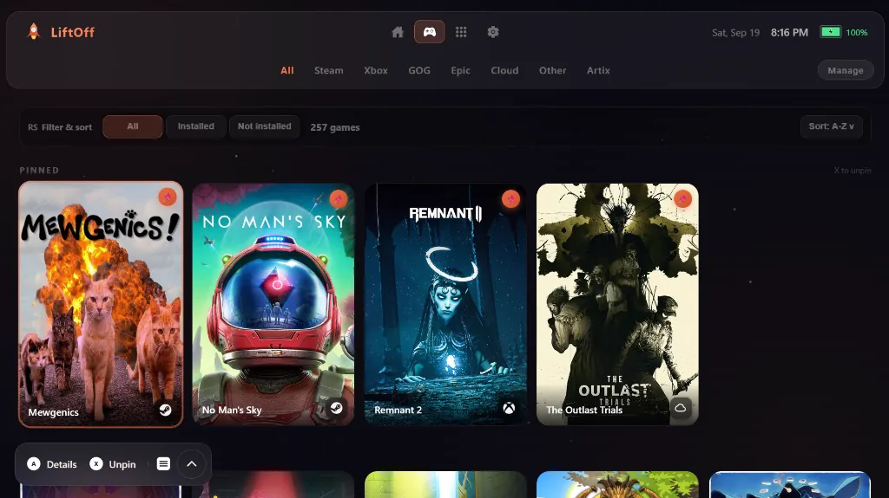
  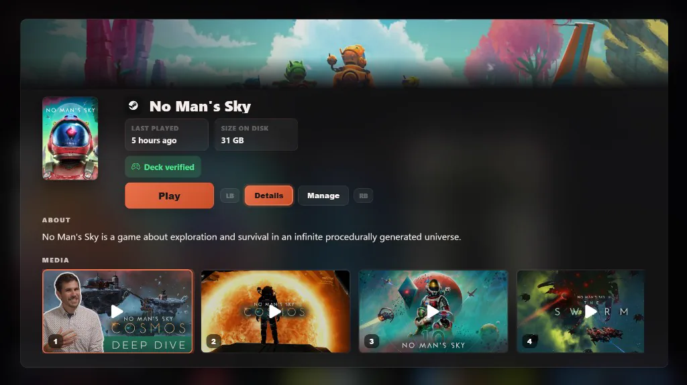
</p>
<p align="center">
  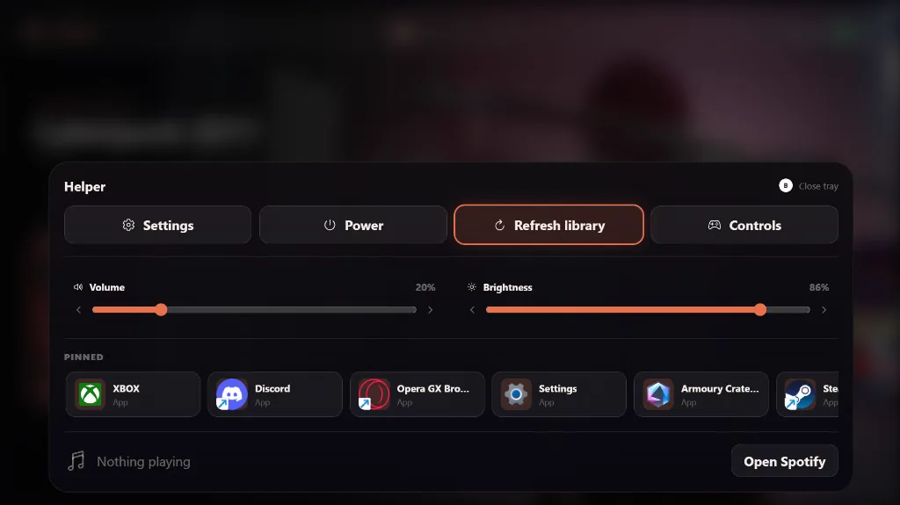
  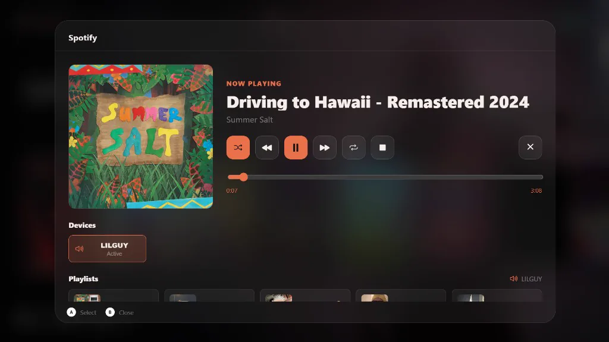
</p>
<p align="center">
  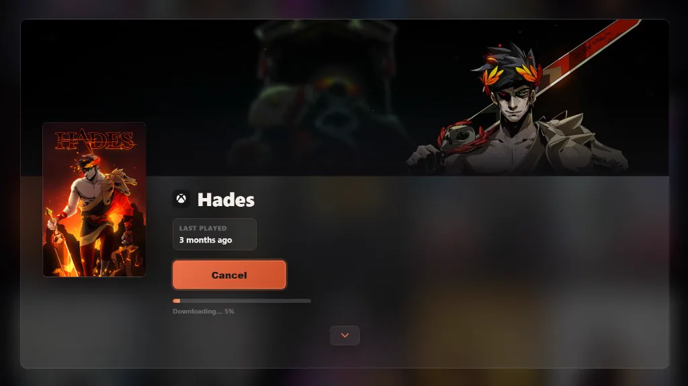
  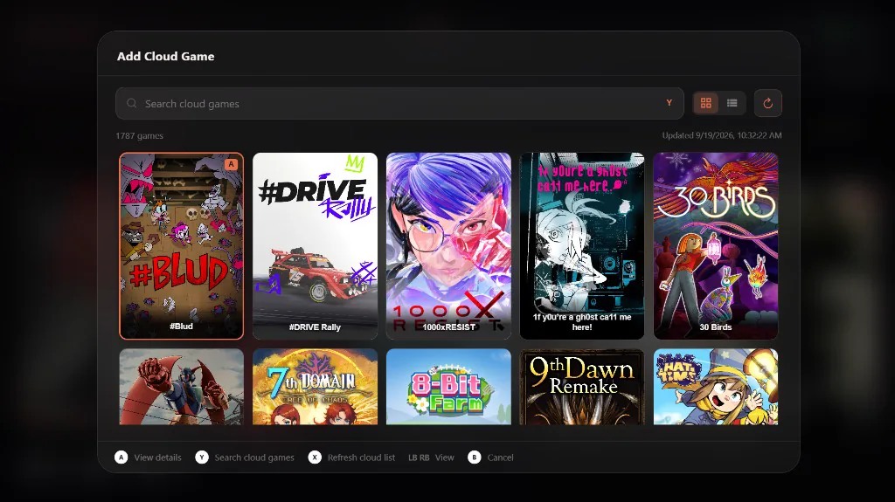
</p>
<p align="center">
  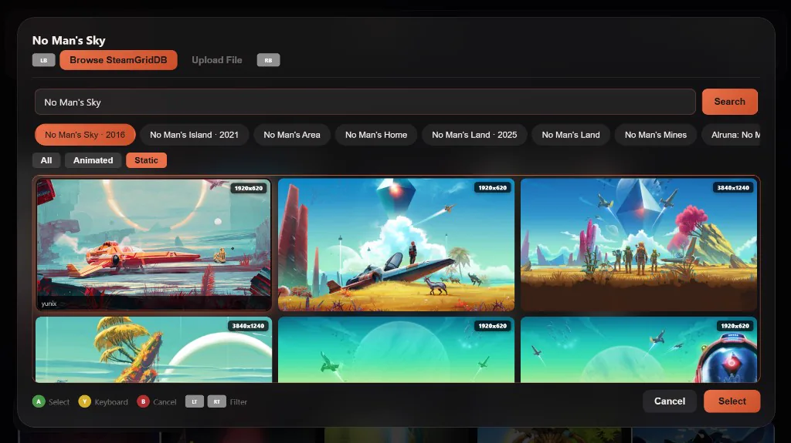
  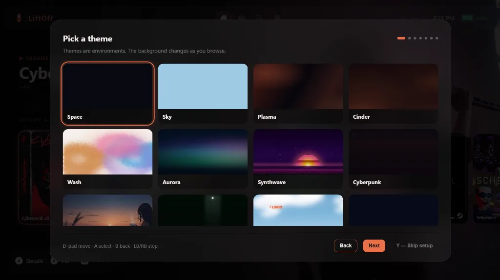
</p>
<p align="center">
  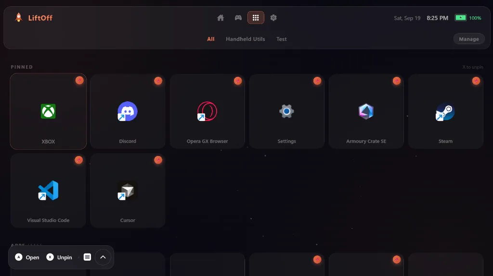
  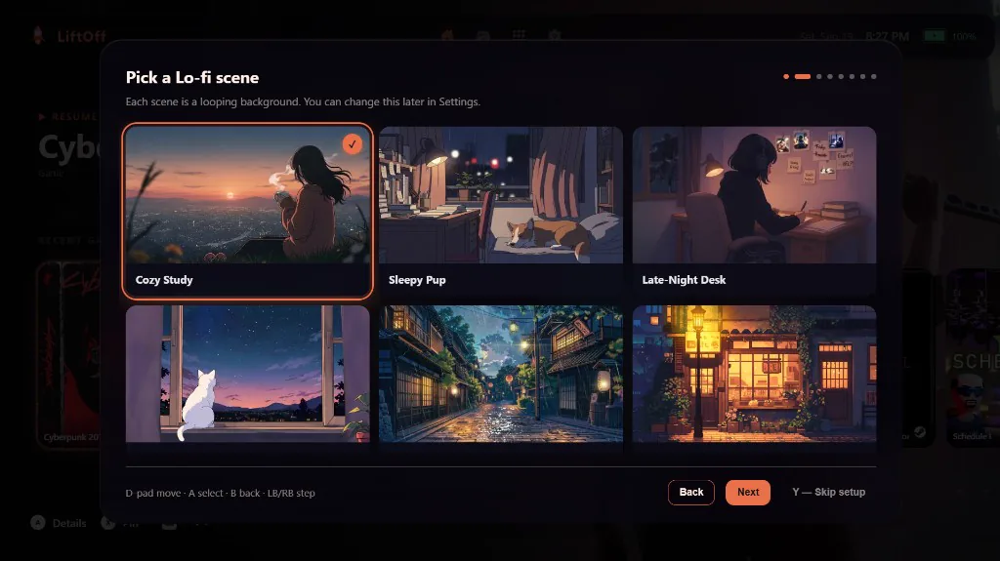
</p>

More looks (12 themes × 12 accents) on [the site](https://liftofflauncher.app/#themes).

---

## Features

- **Gamepad-native** — D-pad and stick navigation, bumper tab switching, hold-to-repeat, on-screen button hints. Built and tested on a ROG Ally X.
- **Your full Steam library** — sign in with a QR code; owned-but-not-installed games show up with playtime. Install, verify, or uninstall from Game Details (the Steam client still does the download).
- **Game Pass installs** — connect a Microsoft account, start installs from Details, see free space first, and watch progress without opening the Store.
- **GOG, Epic, Battle.net, and cloud** — installed GOG/Epic/Battle.net titles get their own source tabs. Add cloud games from a catalog and launch them full screen.
- **Game Details** — art, description, screenshots, trailers, last played, size, Steam Deck rating, Play / Install / Manage. Apps get a Details screen too.
- **Spotify** — playlists, transport, Connect device picker, and a now-playing bar. MENU opens the helper tray; Spotify lives there and on Home.
- **Helper tray** — one MENU press for Settings, power (including Restart/Shut Down PC), library refresh, volume, brightness, pins, and music. Bottom bar modes: Smart, Full, or Hidden.
- **Artwork** — covers and hero banners from SteamGridDB, including animated heroes. Search for the right game match, or upload your own.
- **Looks** — 12 animated themes, 12 accents, 7 surface styles (Glass, Aero, Material, Clear, Obsidian, Neon, Win9X). Lo-fi has six looping scenes. Home layouts: Normal (default), Immersive, Legacy.
- **First-run setup** — language, look, stores, and optional accounts, all on a controller. English, French, and Spanish.
- **Handheld-friendly launching** — quieter Steam, honest launch progress, GPU/memory relief while a game is in front, and a faster return to LiftOff.

---

## Installation

Download the NSIS installer from the [Releases](../../releases) page and run it.

> **Windows SmartScreen may show a warning** since the app is not code-signed. Click **More info → Run anyway**. That is expected for unsigned indie software.
>
> LiftOff is open source ([GPL v3](LICENSE)). No telemetry. Steam, Microsoft, and Spotify sign-in are optional; refresh tokens are stored in Windows Credential Manager, not in the repo or logs.

---

## Controls

| Button | Action |
|--------|--------|
| **A** | Confirm / open Details |
| **B** | Back / cancel. From Home, Games, Apps, or the Settings root, opens the power menu |
| **X** | Pin / unpin |
| **Y** | Search (on-screen keyboard) |
| **Menu (Start)** | Helper tray |
| **Select / Back** | Library actions on Games / Apps (add cloud game, manage hidden titles, …) |
| **LB / RB** | Switch tabs |
| **LT / RT** | Switch game source |
| **Right stick** | Games filter / sort toolbar |
| **D-pad / Left stick** | Navigate |
| **Right-click** | Context menu (mouse) |

Selecting a game opens **Game Details**; Play is the button inside that screen. Apps open **App Details**, then Open. On Home you can turn on “Launch games directly” if you want one-press launch. Pins live on Games/Apps and in the helper tray, not on Home.

Volume, brightness, and Spotify seek in the helper tray need **A** before Left/Right change the value.

---

## Tabs

**Home** — hero spotlight, recents, collections. Layouts: Normal, Immersive, Legacy.

**Games** — installed and owned games, filterable by source (Steam, Game Pass, Battle.net, GOG, Epic, Cloud, …) and by All / Installed / Not installed.

**Apps** — non-game apps and shortcuts.

**Settings** — Appearance (Style, Home Screen, Layout, Navigation), Library, Controller, Data, language, accounts, and updates.

---

## Settings (short tour)

Appearance covers theme, accent, surface, Home mode, hero banners, cover scale, wide layout, tab icons, bar backgrounds, UI motion, sound effects, Lo-fi music/scene, and UI scale. Library covers scan sources (Steam, Game Pass, Store apps, Desktop, Battle.net, GOG, Epic), not-installed games, store badges, and account rows. Controller covers glyphs, vibration, repeat speed, the return shortcut, and the live tester. Data lists drive space, factory reset, and storage.

Automatic update checks can watch **Stable** or **Alpha / Beta**. Factory reset wipes local data and signed-in accounts, then restarts into first-run setup.

---

## Building from Source

**Prerequisites:** [Node.js](https://nodejs.org/) 18+, [Rust](https://rustup.rs/). The Tauri CLI is already in this repo’s npm dependencies.

```bash
npm install

# SteamGridDB API key (required to fetch art). Get one at:
# https://www.steamgriddb.com/profile/preferences/api
echo SGDB_API_KEY=your_key_here > src-tauri/.env
```

**Dev:**

```bash
npm run dev
npm run tauri -- dev
```

**Tests:** `npm run test` (Vitest), `npm run test:e2e` (mocked-Tauri Playwright), `npm run test:all` (both). Those do not prove real WebView2, controller feel, or store accounts.

**Installer:**

```bash
npm run tauri -- build
# Output: src-tauri/target/release/bundle/nsis/
```

Use the NSIS bundle for release testing, not the raw executable.

---

## Data Storage

App data lives in `%LOCALAPPDATA%\LiftOff\` (settings, library caches, artwork, store metadata, Lo-fi media). Steam, Microsoft, and Spotify refresh tokens are stored in **Windows Credential Manager**, not in those JSON files.

---

## Contributors

- **[moi952](https://github.com/moi952)** — localization (French) and i18n, SteamGridDB art browser, custom sources and rename, controller glyphs/auto-detect, layout and Home customization, and a large share of the settings/UI work

---

## Support

LiftOff is free and always will be. Report bugs or try builds on [Discord](https://discord.gg/F5ncP75WtD). If it earns a spot on your handheld, a coffee keeps the updates coming.

[](https://discord.gg/F5ncP75WtD)
[](https://buymeacoffee.com/liftoff_handheld_launcher)

---

## Stack

- [Tauri 2](https://tauri.app/) — Rust backend, WebView2 frontend
- [React](https://react.dev/) — UI
- [SteamGridDB](https://www.steamgriddb.com/) — cover and hero art
